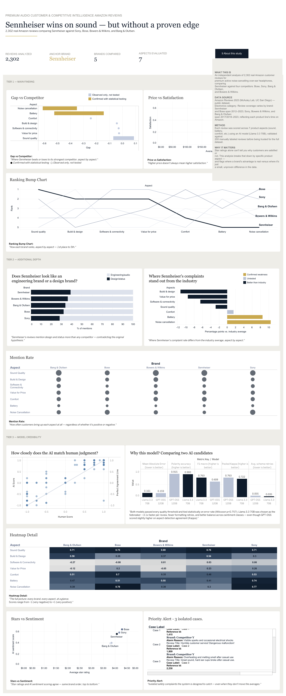

# Customer & Competitive Intelligence for Amazon Reviews V1

**Turning customer reviews into competitive intelligence for the premium headphone market.**

> Case study developed during the Data Analytics & AI program, WBS Coding School — now the foundation of a reusable decision-intelligence system.
> **V1** — see [Limitations & next steps](#limitations--next-steps) for what V2 will include.

## What this repository is — and isn't

This repository shows how I approach a problem: sourcing and understanding real-world data with rigor, before building anything on top of it. It is **not** a full code walkthrough of the analysis engine.

The AI pipeline, the model-validation protocol, the statistical significance testing, and the dashboard-preparation logic are part of a reusable system I designed to turn large volumes of customer reviews into competitive intelligence — for this case, and adaptable to others. That system is the product, not the demonstration, so its code lives outside this public repository.

What you'll find here instead: the data-foundation work (`00`, `01`), the SQL used to clean and structure it, and a full account — in writing — of the methodology, the findings, and the rigor behind the rest of the system. If you want to see the system in action, the [live dashboard](#dashboard) is public. If you want to discuss applying it to your own data, [reach out](#author).

## The business question

Does Sennheiser actually know how it stacks up against Bose, Sony, Bang & Olufsen, and
Bowers & Wilkins — not according to marketing claims, but according to what customers
say in their own words?

More broadly: by 2025, over 75,000 independent sellers surpassed $1M in sales on Amazon alone — a 36% jump from the year before. Every one of those brands needs to understand its competitive position to get there, or to keep it. This project is a working answer to that need, built on real data instead of intuition.

**Scope note:** every brand-level finding below refers specifically to that brand's
premium ANC over-ear headphone line as sold on Amazon — not the brand as a whole.

## Dashboard

🔗 **[Explore the interactive dashboard on Tableau Public](https://public.tableau.com/app/profile/fkeilers/viz/PremiumAudioDashboardFinalPresentation/00_Dashboard_Final_Presentation)** <!-- ⚠️ PENDING: update this URL once the Tableau workbook is renamed to match the V1 project name -->
*(opens in this same tab — use Cmd/Ctrl+click to open it in a new one)*



## What's in this repository

1. **`00_dataset_exploration.ipynb`** — real exploratory analysis of the Amazon Reviews 2023 dataset (McAuley Lab): where the Electronics category sits among 33 categories, schema extraction, sampling checks. This is the diagnostic work that catches problems — like an early over-matching issue with one brand's product line — before they become bugs downstream.
2. **`01_data_collection.ipynb`** — brand and product-line filtering logic, plus a resilient streaming-collection process (retries, incremental checkpointing) against a very large source file.
3. **`sql/`** — the four SQL scripts used to clean, join, index, and verify the data in MySQL: schema creation, deduplication and joining logic, indexing, and verification queries.

## What isn't in this repository, and why

- **The AI analysis engine** — a multi-provider, model-agnostic pipeline (works with more than one AI provider and any model, as a configuration choice, not hardcoded logic) that turns unstructured review text into structured, comparable data across seven aspects per review.
- **The model-validation protocol** — a bake-off between candidate AI models against a 200-review human-labeled ground truth, with pass/fail criteria fixed *before* seeing results.
- **The statistical layer** — bootstrap confidence intervals applied to the headline findings, to separate real competitive gaps from sampling noise.
- **The critical-alert detector** — an automated check for rare, isolated safety-relevant signals across thousands of reviews.
- **The Tableau-preparation pipeline** — the logic that turns validated analysis output into dashboard-ready tables.

These are described in full, in writing, below — methodology and findings are public; the executable engine that produces them is not.

## Methodology (described, not included as runnable code)

1. **Ground truth** — 200 reviews labeled by hand (overall sentiment + 7 aspect scores), used as the accuracy benchmark for any AI model considered.
2. **AI pipeline** — a structured prompt sent to an LLM through a multi-provider, model-agnostic architecture, returning a strict schema per review, with automatic retries and checkpointing.
3. **Model bake-off** — two candidate models evaluated against the same ground truth, under a protocol with thresholds fixed before seeing which model would win. Both cleared the bar; the deciding factors were processing speed, formatting reliability, and balanced classification — with the trade-off against the model not chosen stated openly, not hidden.
4. **Competitive analysis** — the winning model run over the full 2,302-review corpus, with confidence intervals and significance testing applied to the headline findings, not just raw averages.
5. **Dashboard** — results delivered as a public, interactive Tableau dashboard, plus a private executive report with business recommendations.

## Data source

[Amazon Reviews 2023](https://amazon-reviews-2023.github.io/) (McAuley Lab, UCSD) —
a large-scale, publicly available dataset of Amazon.com product reviews, licensed under
CC BY-SA 4.0 ([license confirmation](https://huggingface.co/datasets/McAuley-Lab/Amazon-Reviews-2023)).
Used here for research purposes, with attribution:

```
@article{hou2024bridging,
  title={Bridging Language and Items for Retrieval and Recommendation},
  author={Hou, Yupeng and Li, Jiacheng and He, Zhankui and Yan, An and Chen, Xiusi and McAuley, Julian},
  journal={arXiv preprint arXiv:2403.03952},
  year={2024}
}
```

*This project is not affiliated with, endorsed by, or sponsored by Amazon.com, Inc. "Amazon" is referenced only as the public source of the review data analyzed.*

## Tech stack

- **Python** (pandas, numpy, Hugging Face `datasets`) for data collection and exploration
- **MySQL** (Workbench + SQLAlchemy) for cleaning and structuring the data — queries in [`sql/`](sql/)
- **AI/LLM integration, structured-output validation, statistical testing, and BI tooling** power the private system layer described above

## Key findings

*(scope: each brand's premium ANC headphone line only; full detail in the private executive report)*

- **Sound quality is Sennheiser's highest-scoring aspect, but not a statistically proven edge** — the five brands are effectively tied.
- **Battery life and noise cancellation are Sennheiser's two real, statistically confirmed weak points** — specifically against Bose and Sony.
- **Sennheiser has the best perceived value-for-money of the five** — but Bose achieves higher overall satisfaction at a comparable price, making Bose the real benchmark on that trade-off.
- **A design-vs-engineering hypothesis did not hold up:** Sennheiser's own reviewers mention design and comfort proportionally *more* than Sony's or Bose's do.
- The system also includes an automated check for rare-but-critical safety-relevant signals — the kind of case a simple average would never surface.

## How to explore this

```bash
git clone https://github.com/FkEilers/customer-competitive-intelligence-amazon-reviews-v1.git
cd customer-competitive-intelligence-amazon-reviews-v1
python -m venv venv
source venv/bin/activate      # Windows: venv\Scripts\activate
pip install -r requirements.txt
```

Notebooks `00` and `01` run end-to-end against the public Amazon Reviews 2023 dataset. The SQL scripts in `sql/` show the cleaning and structuring logic applied afterward. The rest of the pipeline — the part that turns this clean data into validated competitive intelligence — is not included here; see [the dashboard](#dashboard) for the output, or reach out below to discuss the system itself.

## Data validation & methodological rigor

Before drawing any conclusions, several questions were investigated with evidence rather than assumed:

- **Unit of analysis:** brand-level, specifically within each brand's premium ANC headphone line — not individual product models, and not the brand as a whole company.
- **Temporal coverage:** verified per brand — review dates span ~5.4 to ~10.3 years, reaching the dataset's own September 2023 cutoff, consistent with real product-generation cycles.
- **Language:** checked with automated detection rather than assumed English-only; non-English reviews were 0.17% of the sample.
- **Data-quality checks:** duplicates and referential integrity were checked and resolved with a documented, reasoned rule before any modeling began.
- **AI accuracy, not just data quality:** the pipeline was validated against a human-labeled ground truth using a protocol fixed before seeing results.
- **Statistical significance, not just raw differences:** headline findings — including one that turned out unfavorable to the "clean win" narrative — were tested with the same rigor applied to every other claim.

## Limitations & next steps

- The dataset covers Amazon.com reviews up to September 2023 — no real-time signal.
- Price data is missing for a meaningful share of Sennheiser reviews (~53%), traced to discontinued variants — any price finding uses the effective available sample, not the full count.
- The critical-alert detector is currently keyword-based, not AI-based — it can miss real cases described with different wording. Replacing it with a model-evaluated field is the next planned improvement.
- The next application of this system: adapting it beyond Amazon to reviews from other platforms (Google Maps, Yelp, TripAdvisor), and beyond headphones to other product and service categories.

## Author

**Frank Eilers** — I design decision-intelligence systems that help organizations operating in complex, international contexts understand their environment with more clarity, so they can decide with better judgment. AI, data analysis, and business strategy are tools in service of that — not the point in themselves.

[Website](https://www.fkeilers.com) · [LinkedIn](https://www.linkedin.com/in/fkeilers/) · [Tableau Public](https://public.tableau.com/app/profile/fkeilers) · [GitHub](https://github.com/FkEilers)
